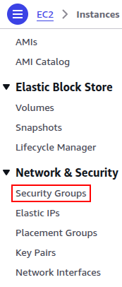
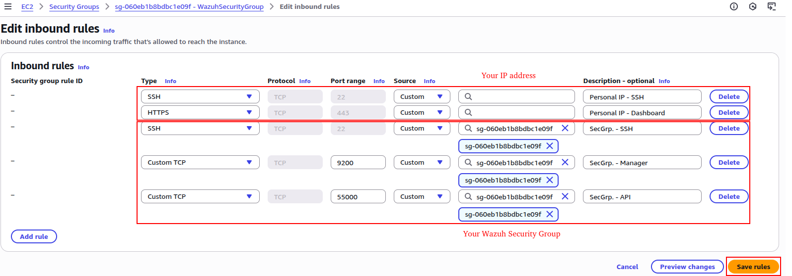

# Wazuh SIEM deployment with AWS 

&nbsp;

# ℹ️ About this project
This project documents a complete deployment of **Wazuh** on separated machines for the indexer, server, and dashboard on **AWS**, following a structure closer to **production environments**. The goal is to have a reusable setup that can serve as a foundation for future projects related to SOC operations.

**❗ Please note:**
- I am not an expert, so there might be significant mistakes. If you spot any, I would greatly appreciate your feedback.
- I mainly created this repository to use as a **cheatsheet** to speed up deployments when helping clients.
- The setup is designed with a **retention period of ~90 days** and is intended for **low log ingestion**.
- The estimated complete deployment time is **around 4 to 6 hours**, under normal circumstances.
- All steps are based on the official documentation available at: [Wazuh Installation Guide](https://documentation.wazuh.com/current/installation-guide/) (as of 25/08/2025).

&nbsp;

---

&nbsp;

# 🤔💭 What is Wazuh
Wazuh is a **SIEM** (Security Information and Event Management), **event and log correlator**, capable of ingesting a large amount of information from agents and endpoints. It can **ingest, correlate, and categorize** anything sent from **rsyslog**.

&nbsp;

# 💰 Cost Estimate & Instance Selection 

## 1. **Wazuh Indexer (Elasticsearch-based)**
| Level       | Instance type | Specs             | USD/h  | USD/30d (720h) |
| ----------- | ------------- | ----------------- | ------ | -------------- |
| Minimum     | t3.large      | 2 vCPU, 8 GB RAM  | 0.0832 | **60.74**      |
| Recommended | m5.2xlarge    | 8 vCPU, 32 GB RAM | 0.384  | **280.32**     |

## 2. **Wazuh Server (Manager)**
| Level          | Instance type | Specs             | USD/h  | USD/30d (720h) |
| -------------- | ------------- | ----------------- | ------ | -------------- |
| Minimum stable | t3.medium     | 2 vCPU, 4 GB RAM  | 0.0416 | **30.37**      |
| Recommended    | t3.xlarge     | 4 vCPU, 16 GB RAM | 0.1664 | **121.47**     |

## 3. **Wazuh Dashboard**
| Level          | Instance type | Specs            | USD/h  | USD/30d (720h) |
| -------------- | ------------- | ---------------- | ------ | -------------- |
| Minimum stable | t3.medium     | 2 vCPU, 4 GB RAM | 0.0416 | **30.37**      |
| Recommended    | t3.medium     | 2 vCPU, 4 GB RAM | 0.0416 | **30.37**      |

## 4. Storage (EBS volumes)
Estimated **~20 USD/month** across all components (gp3 SSD volumes: 50–200 GB, depending on retention).

## 5. Total monthly cost estimate (30 days, 24/7)
|Scenario|Indexer (USD)|Server (USD)|Dashboard (USD)|Storage (USD)|**Total (USD)**|
|---|---|---|---|---|---|
|Minimum stable setup|60.74|30.37|30.37|20|**141.48**|
|Recommended setup|280.32|121.47|30.37|20|**452.16**|

&nbsp;

# 🧾 Requisites

## Wazuh indexer
|         | Minimum (t3.medium) | Recommended (m5.2xlarge) |
| ------- | ------------------- | ------------------------ |
| OS      | Unbuntu 16.04       | Unbuntu 16.04            |
| RAM     | 4 GB                | 16 GB                    |
| CPU     | 2 cores             | 8 cores                  |
| Storage | 50 GB               | 200 GB                   |

## Wazuh server
|         | Minimum (t3.medium) | Recommended   |
| ------- | ------------------- | ------------- |
| OS      | Unbuntu 16.04       | Unbuntu 16.04 |
| RAM     | 2 GB                | 4 GB          |
| CPU     | 2 cores             | 8 cores       |
| Storage | 50 GB               | 200 GB        |

## Wazuh dashboard
|         | Minimum (t3.medium) | Recommended   |
| ------- | ------------------- | ------------- |
| OS      | Unbuntu 16.04       | Unbuntu 16.04 |
| RAM     | 4 GB                | 8 GB          |
| CPU     | 2 cores             | 4 cores       |
| Storage | 50 GB               | 200 GB        |

&nbsp;

---

&nbsp;

# 🛠️ Installation & Setup

## 📦 Setting up AWS

### 1️⃣ VPC
1. Inside of the AWS - **VPC** page, in the left column, select **Your VPCs** option (inside *Virtual private cloud*).

    

2. Then, **Create VPC**.

    

3. Choose a name tag (recommended to find it between different VPC) and select an IP range, in this case **10.10.10.0/24**.

    

4. Finally, write again the VPC name and **Create VPC**.

    

### 2️⃣ Subnet
1. Inside of the AWS - _VPC_ page, in the left column, select **Subnets** option (inside _Virtual private cloud_).

    

2. Then, **Create subnet**.

    

3. Select the VPC that we created in the previous steps.

    

4. Choose a VPN CIDR block and **Create subnet**.

    

### 3️⃣ Security group

1. Inside of the AWS EC2 - _Instances_ page, in the left column, select **Security Groups** option (inside _Network & Security_).

    

2. Then, **Create security group**.

    

3. Select the _WazuhVPC_, created in the VPC step and **Create security group**. For now, we leave it empty because we need the group ID for the next step.

    
    

5. Inside the security group, edit the inbound rules and allow the ports shown in the image. Add your public IP to have connection with the instances, and the security group ID so the 3 instances will be able to connect to each other.

    

6. Save the changes and check that everything is correct.

    
   
   
###  4️⃣ Network interfaces

1. Inside of the AWS EC2 - _Instances_ page, in he left column, select **Network Interfaces** option (inside _Network & Security_).

    

2. Then, **Create network interface**.

    

3. Choose a name (_indexer, server and dashboard_), select the subnet created previously, and choose an IP inside the range (_30, 31 and 32_).

    
    
    

5. Select the WazuhSecurityGroup created previously and **Create network intercace**.

    

6. Finally, check that each network interface has its own private IP, inside the defined range on the VPC.

    

&nbsp;

## 🚀 Setting up Wazuh indexer

&nbsp;

## 🚀 Setting up Wazuh server

&nbsp;

## 🚀 Setting up Wazuh dashboard

