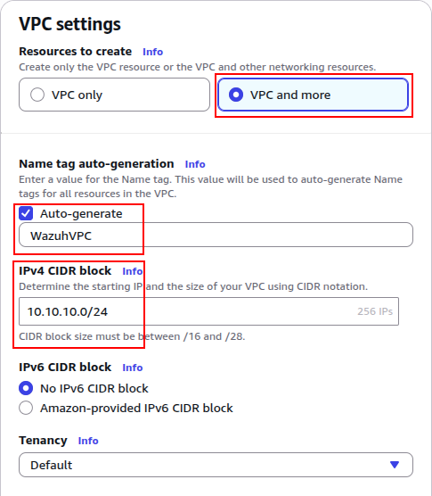
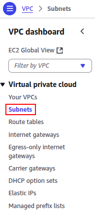
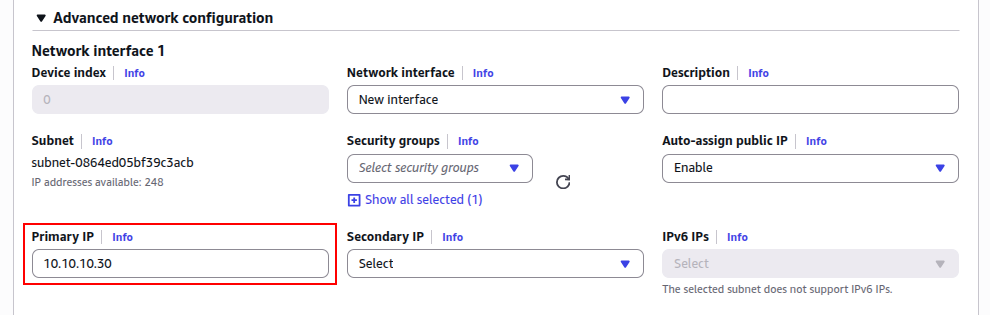
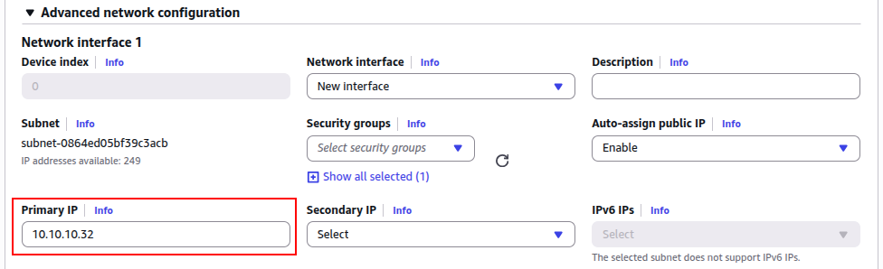
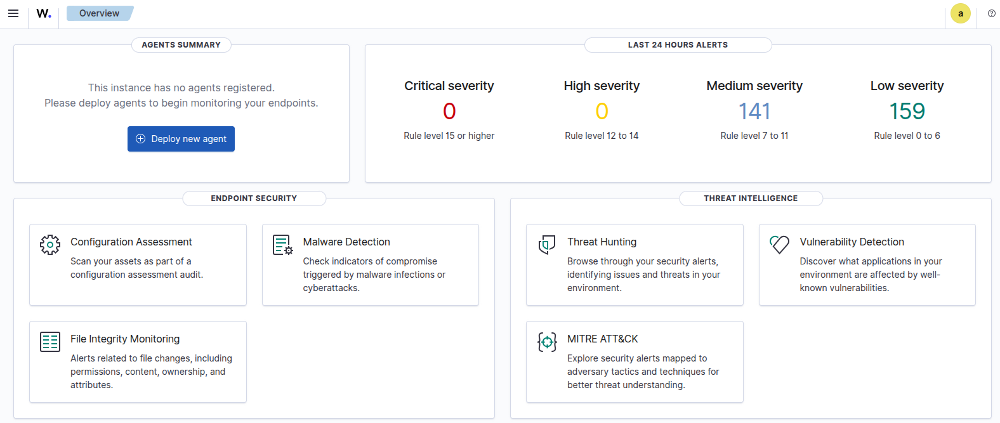

# Wazuh SIEM deployment with AWS

&nbsp;

## INDEX

- [ℹ️ About this project](#ℹ%EF%B8%8F-about-this-project)

- [🤔💭 What is Wazuh](#-what-is-wazuh)

- [💰 Cost Estimate & Instance Selection ](#-cost-estimate--instance-selection)

- [🧾 Requisites](#-requisites)

- [🛠️ Installation & Setup](#%EF%B8%8F-installation--setup)

    - [📦 Setting up AWS](#-setting-up-aws)

    - [🚀 Setting up Wazuh indexer](#-setting-up-wazuh-indexer)

    - [🚀 Setting up Wazuh server](#-setting-up-wazuh-server)
 
    - [🚀 Setting up Wazuh dashboard](#-setting-up-wazuh-dashboard)

- [👋 Personal notes](#-personal-notes)

---

&nbsp;

---

# ℹ️ About this project
This project documents a complete deployment of **Wazuh** on separate machines for the indexer, server, and dashboard on **AWS**. The goal is to have a reusable setup that can serve as a foundation for future projects related to SOC operations.

**❗ Please note:**
- I am not an expert with AWS or Wazuh, so there might be significant mistakes. If you spot any, I would greatly appreciate your feedback.
- I mainly created this repository to use as a **cheatsheet** to speed up deployments when helping clients.
- The estimated complete deployment time is **around 4 to 6 hours**, under normal circumstances.
- All steps are based on the official documentation available at: [Wazuh Installation Guide](https://documentation.wazuh.com/current/installation-guide/) (as of 25/08/2025).

&nbsp;

---

&nbsp;

# 🤔💭 What is Wazuh
Wazuh is a **SIEM** (Security Information and Event Management), **event and log correlator**, capable of ingesting a large amount of information from agents and endpoints. It can **collect, correlate, and categorize** anything sent from **rsyslog**.

&nbsp;

# 💰 Cost Estimate & Instance Selection 

## 1. **Wazuh Indexer (Elasticsearch-based)**
| Level       | Instance type | Specs             | USD/h  | USD/30d (720h) |
| ----------- | ------------- | ----------------- | ------ | -------------- |
| Minimum     | t3.large      | 2 vCPU, 8 GB RAM  | 0.0832 | **60.74**      |
| Recommended | m5.2xlarge    | 8 vCPU, 32 GB RAM | 0.384  | **280.32**     |

## 2. **Wazuh Server (Manager)**
| Level          | Instance type | Specs             | USD/h  | USD/30d (720h) |
| -------------- | ------------- | ----------------- | ------ | -------------- |
| Minimum stable | t3.medium     | 2 vCPU, 4 GB RAM  | 0.0416 | **30.37**      |
| Recommended    | t3.xlarge     | 4 vCPU, 16 GB RAM | 0.1664 | **121.47**     |

## 3. **Wazuh Dashboard**
| Level          | Instance type | Specs            | USD/h  | USD/30d (720h) |
| -------------- | ------------- | ---------------- | ------ | -------------- |
| Minimum stable | t3.medium     | 2 vCPU, 4 GB RAM | 0.0416 | **30.37**      |
| Recommended    | t3.medium     | 2 vCPU, 4 GB RAM | 0.0416 | **30.37**      |

## 4. Storage (EBS volumes)
Estimated **~20 USD/month** across all components (gp3 SSD volumes: 50–200 GB, depending on retention).

## 5. Total monthly cost estimate (30 days, 24/7)
|Scenario|Indexer (USD)|Server (USD)|Dashboard (USD)|Storage (USD)|**Total (USD)**|
|---|---|---|---|---|---|
|Minimum stable setup|60.74|30.37|30.37|20|**141.48**|
|Recommended setup|280.32|121.47|30.37|20|**452.16**|

&nbsp;

# 🧾 Requisites

## Wazuh indexer
|         | Minimum (t3.medium) | Recommended (m5.2xlarge) |
| ------- | ------------------- | ------------------------ |
| OS      | Ubuntu 16.04        | Ubuntu 16.04             |
| RAM     | 4 GB                | 16 GB                    |
| CPU     | 2 cores             | 8 cores                  |
| Storage | 50 GB               | 200 GB                   |

## Wazuh server
|         | Minimum (t3.medium) | Recommended (m5.2xlarge)  |
| ------- | ------------------- | ------------------------- |
| OS      | Ubuntu 16.04        | Ubuntu 16.04              |
| RAM     | 2 GB                | 4 GB                      |
| CPU     | 2 cores             | 8 cores                   |
| Storage | 50 GB               | 200 GB                    |

## Wazuh dashboard
|         | Minimum (t3.medium) | Recommended (same as minimum)  |
| ------- | ------------------- | ------------------------------ |
| OS      | Ubuntu 16.04        | Ubuntu 16.04                   |
| RAM     | 4 GB                | 8 GB                           |
| CPU     | 2 cores             | 4 cores                        |
| Storage | 50 GB               | 200 GB                         |

&nbsp;

---

&nbsp;

# 🛠️ Installation & Setup

## 📦 Setting up AWS

### 1️⃣ VPC
1. On the AWS - **VPC** page, in the left column, select **Your VPCs** option (inside *Virtual private cloud*).

    

2. Then, **Create VPC**.

    

3. Choose a name (recommended to help differentiate it from other VPCs) and select an IP range, in this case **10.10.10.0/24**.

    

4. Enable both options DNS resolution and DNS hostname, and then click **Create VPC**.

    

5. Then, inside of Internet gateways, create a new one.

    
   
6. Inside of the new internet gateway, select the option to **attach to VPC**.

    

7. Then, select the VPC we previously created and attach it.

   

8. Enter again to the VPC, and under the resource map, open the route table.

   

9. Edit the routes and add a new one to use the **wazuh-gateway** and save the changes.

   
   


### 2️⃣ Subnet
1. On the AWS - _VPC_ page, in the left column, select **Subnets** option (inside _Virtual private cloud_).

    

2. Then, **Create subnet**.

    

3. Select the VPC that we created in the previous steps.

    

4. Choose a subnet CIDR block and **Create subnet**.

    


### 3️⃣ Security group

1. On the AWS - EC2 _Instances_ page, in the left column, select **Security Groups** option (inside _Network & Security_).

    

2. Then, **Create security group**.

    

3. Select the _WazuhVPC_, created in the VPC step and **Create security group**. For now, we leave it empty because we need the group ID for the next step.

    
    

5. Inside the security group, edit the inbound rules and allow the ports shown in the image. Add your public IP to have connection with the instances, and the security group ID so the 3 instances will be able to connect to each other.

    

6. Save the changes and check that everything is correct.

    

&nbsp;

## 🚀 Setting up Wazuh indexer

### 1️⃣ EC2 instance

1. Choose a name for the instance.

    
   
2. Select the latest Ubuntu Server.

   

3. Change the instance type to _t3.medium_.

    

4. Create a new key pair using the **RSA** key type and **PEM** format.

    
    
    
   
5. Edit the network settings and select the VPC, subnet and security group we created during the **Setting up AWS**. 

    
    
    
   
6. Choose the disk capacity.

     

7. Launch the instance.
  
    


### 2️⃣ Connection and basic configuration
1. Give the correct permissions to your pem file:

   `$ chmod 0600 ./Wazuh_PEM.pem`

2. Connect via SSH to your AWS instance (indexer).

   `$ ssh -i ./Wazuh_PEM.pem ubuntu@<YOUR_INDEXER_PUBLIC_DNS>`

3. Update and install dependencies.

   `$ sudo apt update && sudo apt upgrade -y`

4. 📣 This is an optional step I apply to all instances, only to make the steps easier to follow. To apply the changes, you need to exit and ssh again to the machine.

   `$ sudo hostnamectl set-hostname wazuh-indexer`


### 3️⃣ Initial Wazuh configuration

1. Download the Wazuh installation assistant and the configuration file.
You can skip the second curl command and manually create the config.yml file with the code shown in **step 2**.

    ```
    $ curl -sO https://packages.wazuh.com/4.12/wazuh-install.sh
    $ curl -sO https://packages.wazuh.com/4.12/config.yml
    ```
    
    


2. Edit the `config.yml` file to match your environment and save it (or create a new one if you skipped downloading it.

   ```
    nodes:
      indexer:
        - name: wazuh-indexer-1
          ip: "10.10.10.30"

      server:
        - name: wazuh-server
          ip: "10.10.10.31"

      dashboard:
        - name: wazuh-dashboard
          ip: "10.10.10.32"
    ```
    
    


4. Run the `wazuh-install.sh` as admin.

    `$ sudo bash wazuh-install.sh --generate-config-files`
   
    


5. Later, you will need to copy the `wazuh-install-files.tar` archive to the other instances. If you have multiple indexer nodes, copy it to each of them as well.

    `$ sudo chmod 744 wazuh-install-files.tar`


### 4️⃣ Wazuh indexer nodes installation

1. Using the previously downloaded `wazuh-install.sh`, add the name of the indexer given in the `config.yml` file and execute it. You will have to repeat this step for each Wazuh indexer node in your cluster, replacing the `wazuh-indexer-1` parameter for the according one. This can a few minutes.

   `$ sudo bash wazuh-install.sh --wazuh-indexer wazuh-indexer-1`

    


### 5️⃣ Cluster initialization
   
1. Run the installer again, this time with the `--start-cluster parameter`.

   `$ sudo bash wazuh-install.sh --start-cluster`

    

2. To check if everything was correctly installed, first, retrieve the admin password..

    `$ tar -axf wazuh-install-files.tar wazuh-install-files/wazuh-passwords.txt -O | grep -P "\'admin\'" -A 1` 

    

3. CCopy it, then replace the placeholders in the following command with your **admin password** and the **indexer private IP**. You should have a similar output as shown in the image.

    `$ curl -k -u admin:<ADMIN_PASSWORD> https://<WAZUH_INDEXER_IP>:9200`
   
    

4. Then, check the cluster, replacing the same placeholders as the previous step. You should have a similar output as shown in the image.

    `$ curl -k -u admin:<ADMIN_PASSWORD> https://<WAZUH_INDEXER_IP>:9200/_cat/nodes?v`

    

5. Finally, it is recommended to disable Wazuh automatic updates to avoid potential issues caused by future updates breaking your environment.

    ```
    $ sudo sed -i "s/^deb /#deb /" /etc/apt/sources.list.d/wazuh.list
    $ sudo apt update
    ```

&nbsp;

## 🚀 Setting up Wazuh server

### 1️⃣ EC2 instance

1. Choose a name for the instance.

    
   
3. Select the latest Ubuntu Server.

   

3. Change the instance type to _t3.medium_.

    

4. Select the previously created key pair.

    
   
5. Edit the network settings and select the VPC, subnet and security group we created during the **Setting up AWS**.  

    
    
    
   
6. Choose the disk capacity.

     

7. Launch the instance.
  
    


### 2️⃣ Connection and basic configuration

1. From the **main host** (where the `Wazuh_PEM.pem` file is stored), copy the PEM file to the indexer instance.

   `$ scp -i Wazuh_PEM.pem Wazuh_PEM.pem ubuntu@<YOUR_INDEXER_PUBLIC_DNS>:/home/ubuntu/`

2. From the **wazuh-indexer instance**, copy the previously generated installation file to the server instance.

    `$ scp -i Wazuh_PEM.pem wazuh-install-files.tar ubuntu@<YOUR_SERVER_PRIVATE_DNS>:/home/ubuntu/`

    

3. Connect via SSH to your Wazuh server instance.

    `$ ssh -i Wazuh_PEM.pem ubuntu@<YOUR_SERVER_PUBLIC_DNS>`

4. Update and install dependencies.

   `$ sudo apt update && sudo apt upgrade -y`

5. 📣 This is an optional step I apply to all instances, only to make the steps easier to follow. To apply the changes, you need to exit and ssh again to the machine.

   `$ sudo hostnamectl set-hostname wazuh-server`


### 3️⃣ Wazuh server configuration

1. Download the Wazuh installation assistant script.

    `$ curl -sO https://packages.wazuh.com/4.12/wazuh-install.sh`

2. Run the Wazuh installation assistant with the `--wazuh-server` option and specify the node name (the same one used in the `config.yml`) to install the **Wazuh server**.

    `$ sudo bash wazuh-install.sh --wazuh-server wazuh-server`

    

3. Finally, it is recommended to disable Wazuh automatic updates to avoid potential issues caused by future updates breaking your environment.

    ```
    $ sudo sed -i "s/^deb /#deb /" /etc/apt/sources.list.d/wazuh.list
    $ sudo apt update
    ```

&nbsp;

## 🚀 Setting up Wazuh dashboard

### 1️⃣ EC2 instance

1. Choose a name for the instance.

    
   
3. Select the latest Ubuntu Server.

   

3. Change the instance type to _t3.medium_.

    

4. Select the previously created key pair.

    
   
5. Edit the network settings and select the VPC, subnet and security group we created during the **Setting up AWS**. 

    
    
    
   
6. Choose the disk capacity.

     

7. Launch the instance.
  
    


### 2️⃣ Connection and basic configuration

1. From the **wazuh-indexer instance**, copy the previously generated installation file to the server instance.

    `$ scp -i Wazuh_PEM.pem wazuh-install-files.tar ubuntu@<YOUR_SERVER_PRIVATE_DNS>:/home/ubuntu/`

    

3. Connect via SSH to your Wazuh server instance.

    `$ ssh -i Wazuh_PEM.pem ubuntu@<YOUR_SERVER_PUBLIC_DNS>`

4. Update and install dependencies.

   `$ sudo apt update && sudo apt upgrade -y`

5. 📣 This is an optional step I apply to all instances, only to make the steps easier to follow. To apply the changes, you need to exit and ssh again to the machine.

   `$ sudo hostnamectl set-hostname wazuh-dashboard`


### 3️⃣ Wazuh dashboard configuration

1. Download the Wazuh installation assistant script.

    `$ curl -sO https://packages.wazuh.com/4.12/wazuh-install.sh`

2. Run the Wazuh installation assistant with the `--wazuh-dashboard` option and specify the node name (the same one used in the `config.yml`) to install the **Wazuh dashboard**.

    `$ sudo bash wazuh-install.sh --wazuh-dashboard wazuh-dashboard`

    

3. To make it visible from outside (skip this if you plan to use a VPN, which is a highly recommended option) we will edit the configuration file and change the _server_host_ line for `0.0.0.0`.

    `$ sudo nano /etc/wazuh-dashboard/opensearch_dashboards.yml`
   
    


4. Restart the dashboard and enter to the Wazuh dashboard (`https://<YOUR_DASHBOARD_PUBLIC_DNS>`) using your browser.
    `$ sudo systemctl restart wazuh-dashboard`

    

   
5. To get the login credentials, we will use the following command.

    `$ tar -O -xvf wazuh-install-files.tar wazuh-install-files/wazuh-passwords.txt`

    


6. Then, login to Wazuh dashboard.

    
   

7. Finally, it is recommended to disable Wazuh automatic updates to avoid potential issues caused by future updates breaking your environment.

    ```
    $ sudo sed -i "s/^deb /#deb /" /etc/apt/sources.list.d/wazuh.list
    $ sudo apt update
    ```

&nbsp;

---

&nbsp;

# 👋 Personal notes

This concludes the Wazuh setup. I ran into many issues along the way, but it turned out to be a great learning experience. The current configuration is not hardened for production use — there are still several defaults that should be changed and hardened. Nevertheless, it provides a solid starting point to get experiment with Wazuh and gain a clearer understanding of how its components work together.
